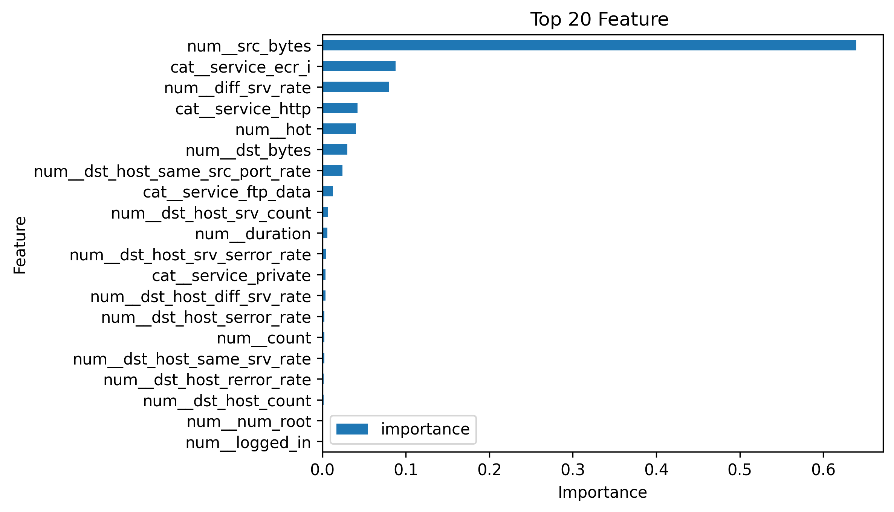
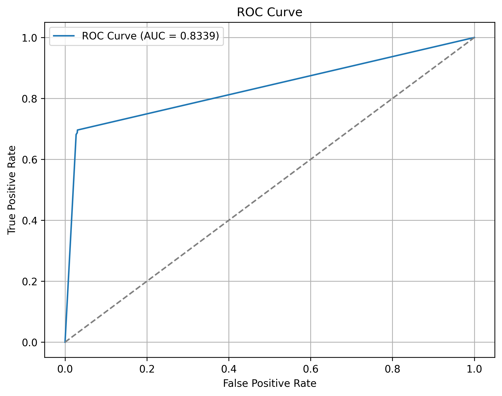
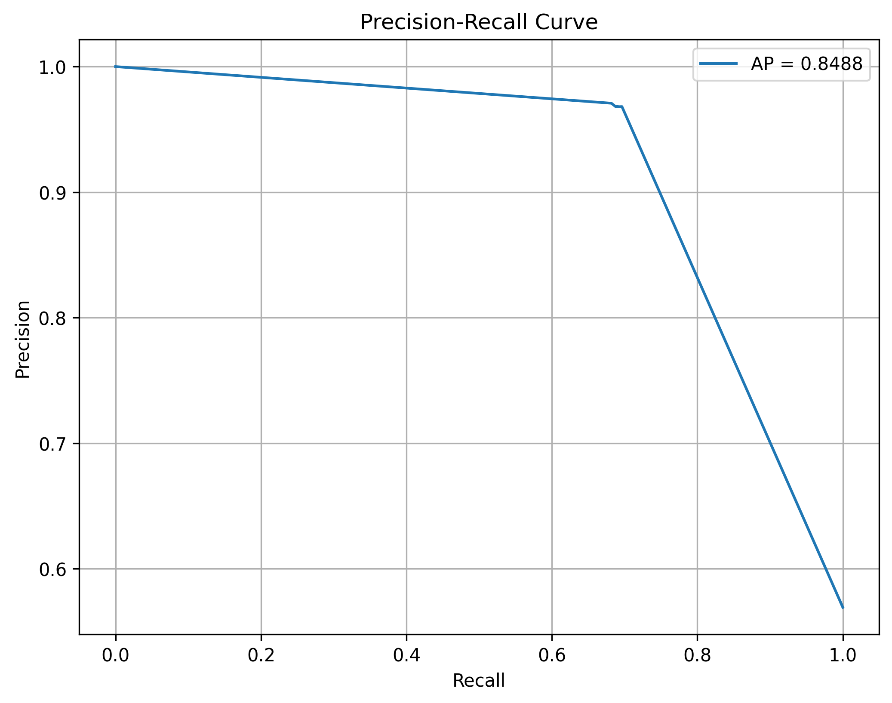
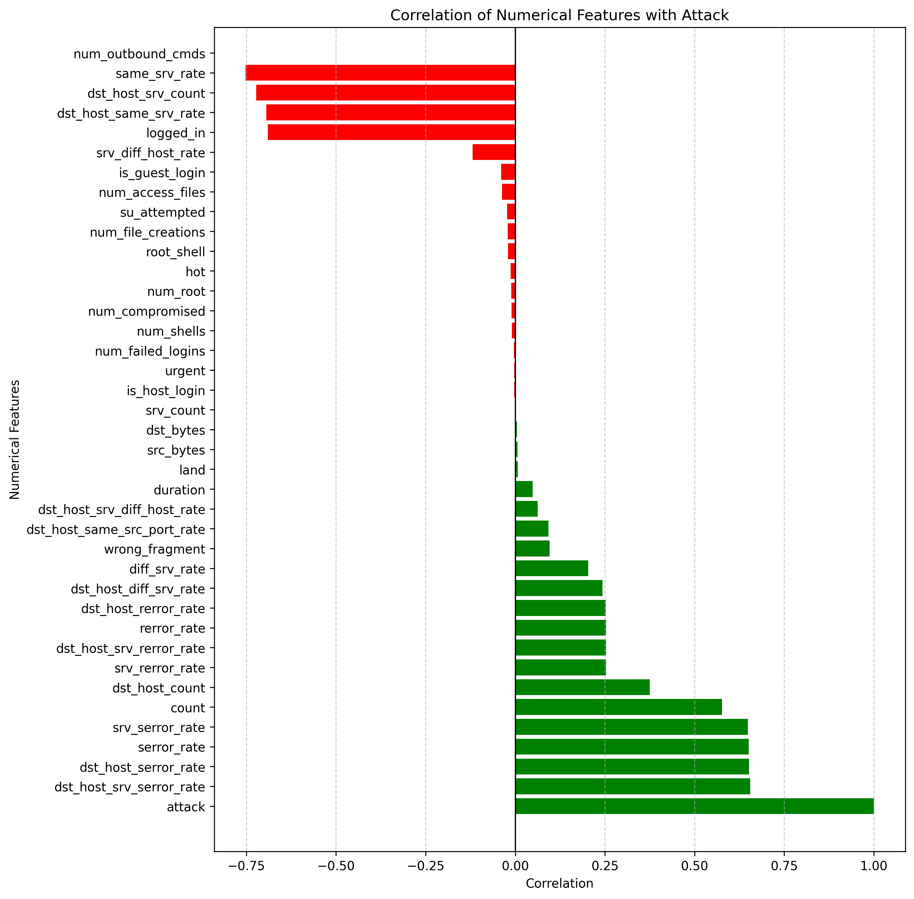

# 🛡️ Network Intrusion Detection System using Machine Learning

## 📌 Project Overview

This project implements a **Network Intrusion Detection System (NIDS)** capable of classifying network traffic as **Normal** or **Attack** using Machine Learning.

The model is trained on the **NSL-KDD dataset**, a benchmark dataset widely used in cybersecurity research for intrusion detection. The project demonstrates a complete end-to-end machine learning workflow, including data preprocessing, feature selection, model training, hyperparameter tuning, evaluation, and prediction on unseen network traffic.

---

# 🎯 Problem Statement

Computer networks are constantly exposed to cyber threats such as:

- Denial of Service (DoS)
- Probe Attacks
- User-to-Root (U2R)
- Remote-to-Local (R2L)

Traditional signature-based intrusion detection systems often fail to detect new or unknown attacks.

The objective of this project is to build a machine learning model capable of automatically classifying network traffic as **Normal** or **Attack**.

---

# 📊 Dataset

**Dataset Used:** NSL-KDD

The dataset contains **41 network traffic features** describing each network connection.

### Target Variable

| Value | Meaning |
|------:|---------|
| 0 | Normal |
| 1 | Attack |

---

# ⚙️ Project Workflow

```text
NSL-KDD Dataset
        │
        ▼
Data Preprocessing
        ▼
Feature Encoding & Scaling
        ▼
Decision Tree Pipeline
        ▼
GridSearchCV
        ▼
Feature Importance
        ▼
Feature Selection
        ▼
Model Retraining
        ▼
Evaluation
        ▼
Prediction
```

---

# 🛠️ Technologies Used

- Python
- Pandas
- NumPy
- Matplotlib
- Scikit-learn
- Joblib

---

# 🤖 Machine Learning Pipeline

- Pipeline
- ColumnTransformer
- StandardScaler
- OneHotEncoder
- DecisionTreeClassifier
- GridSearchCV

The model is optimized using **5-Fold Cross Validation** with **Recall** as the scoring metric.

---

# ⭐ Feature Selection

Feature importance scores are extracted from the trained Decision Tree model. The most important features are selected to retrain the final model.

---

# 📈 Model Evaluation

- Accuracy
- Confusion Matrix
- Classification Report
- ROC Curve
- ROC-AUC Score
- Precision-Recall Curve
- Average Precision Score

---

# 📂 Project Structure

```text
Network-Intrusion-Detection-System/
│
├── Data/
├── Graph/
│   ├── Correlation.png
│   ├── Important_Feature.png
│   ├── ROC_Curve.png
│   └── Precision_Recall.png
│
├── main.py
├── model.pkl
├── feature.pkl
├── Input.csv
├── Output.csv
├── training.log
├── requirements.txt
├── .gitignore
└── README.md
```

---

# 🚀 How to Run

```bash
git clone https://github.com/shiddukuppast/Network-Intrusion-Detection-System.git
cd Network-Intrusion-Detection-System
python main.py
```

---

# 📊 Project Outputs

Include your generated figures in the README:

```markdown
## Feature Importance


## ROC Curve


## Precision-Recall Curve


## Feature Correlation

```

---

# 🔮 Future Improvements

- Compare with Random Forest, XGBoost and LightGBM
- Perform multiclass attack classification
- Deploy using Flask or FastAPI
- Integrate real-time packet capture

---

# 👨‍💻 Author

**Siddesh Kuppast**

B.Tech – Artificial Intelligence & Machine Learning

⭐ If you found this project useful, consider giving the repository a **Star**.
